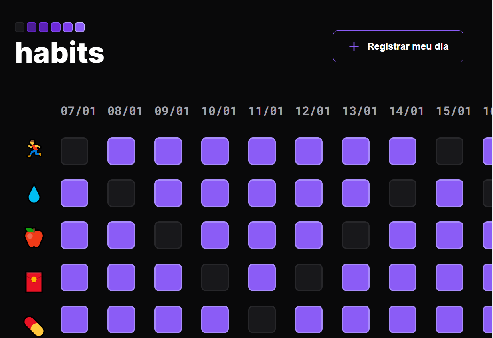

# NLW SETUP - Habits

> <b>Trilha Explorer </b>

> Projeto feito na primeira NLW do ano de 2023 desafio 02 do nível 06 - <b>SPA Universe</b> construído no curso de progrmador fontend trilha Explorer da Rocketseat :rocket:. 

## :hammer_and_wrench: Tecnologias

- HTML
- CSS
- Javascript
- Git e Github

## :nut_and_bolt: Principais pontos abordados

### CSS
- display flex
- Centralizar os elementos HTML usando self

### Javascript

- DOM
- Conceitos de SPA;
- Mapeamento de rotas;
- Assíncrono e promises;
- Orientação a objetos;
- Estrutura de dados com objetos;
- Classes e muito mais.
- Funções em Javascript
- Clean Code
- Muita refatoração
- Event-driven, programação imperativa e callbacks

## :dart:  Desafio

:heavy_check_mark:  A ideia aqui é você utilizar todos os conceitos aprendidos em aula em uma aplicação visualmente mais bonita que irá possibilitar o usuário cadastrar habitos que queira desenvolver ou melhorar como passar do tempo.

## :mailbox_closed: Contatos

> Email - rosendc30@gmail.com

> Linkedin - https://www.linkedin.com/in/francisco-rosendo-coelho/
